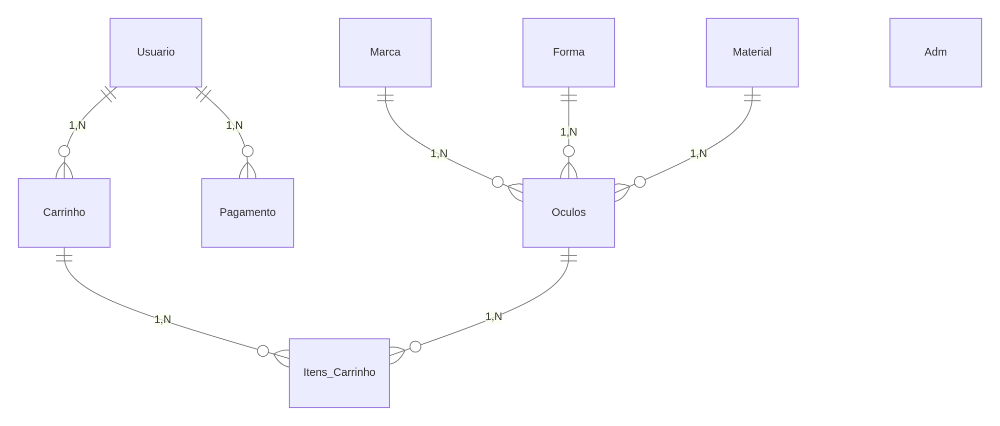

# 🕶️ Sistema de E-commerce de Óculos – README

Este projeto consiste em um sistema de e-commerce para venda de óculos, estruturado a partir de um modelo conceitual contendo entidades como **Usuário**, **Carrinho**, **Pagamento**, **Óculos**, **Marca**, **Forma**, **Material** e **Administrador**.
O objetivo é fornecer uma base sólida para a implementação do banco de dados em **MySQL**, utilizando o **XAMPP** como ambiente de execução.

---

## 📌 Tecnologias Utilizadas

* **MySQL** (via *phpMyAdmin* do XAMPP)
* **XAMPP** para gerenciamento do servidor Apache + MySQL
* Diagrama criado com base no modelo conceitual enviado

---

## 🗂️ Modelo Conceitual

O projeto segue a estrutura representada no diagrama, onde há relacionamentos entre:

* **Usuário** → Carrinho (1,N)
* **Usuário** → Pagamento (1,N)
* **Carrinho** → Itens_Carrinho (1,N)
* **Óculos** → Itens_Carrinho (1,N)
* **Marca**, **Forma**, **Material** → Óculos (1,N)

Além disso, a entidade **Adm** será responsável pela administração do sistema, permitindo manipulação de cadastros de óculos, marcas, formas e materiais.

---

## 🛠️ Como Executar o Projeto

1. Instale o **XAMPP** (versão mais recente recomendada).
2. Inicie os módulos:

   * **Apache**
   * **MySQL**
3. Acesse o *phpMyAdmin* em:

   ```
   http://localhost/phpmyadmin
   ```
4. Crie um novo banco de dados (ex: `ecommerce_oculos`).
5. Importe ou execute o script SQL gerado a partir deste modelo.
6. Conecte sua aplicação (PHP, Node, etc.) ao MySQL utilizando:

   * Host: `localhost`
   * Usuário: `root`
   * Senha: *(vazia por padrão no XAMPP)*

---

## 📁 Estrutura das Tabelas (Resumo)

### **Usuário**

Contém dados básicos do cliente.

### **Carrinho**

Associado ao usuário, armazena as compras em andamento.

### **Pagamento**

Formas e registros de transações do usuário.

### **Óculos**

Produto principal do sistema.

### **Marca / Forma / Material**

Características associadas ao modelo de óculos.

### **Itens_Carrinho**

Relaciona um carrinho com os óculos escolhidos.

### **Adm**

Tabela destinada aos administradores do sistema.

---

## 📎 Diagrama Conceitual



---

